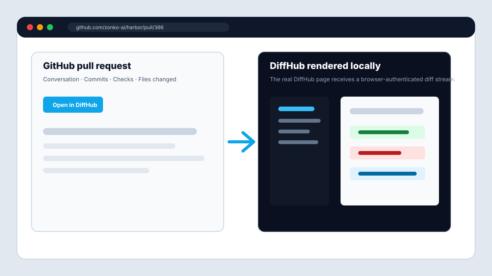
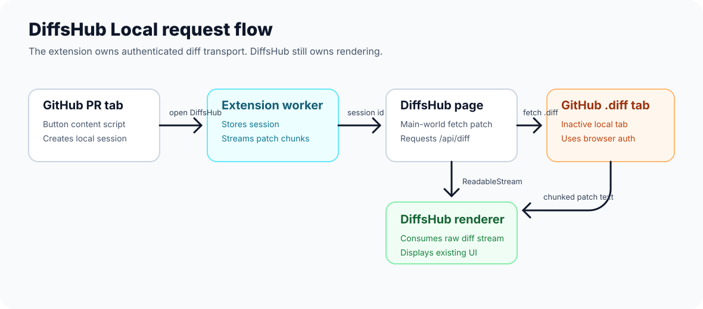

# DiffHub Local

DiffHub Local is a Manifest V3 Chrome extension that lets the public DiffHub UI render pull request diffs that GitHub can only serve to the signed-in browser. It adds an **Open in DiffHub** button to GitHub pull request pages, opens the matching DiffHub route, intercepts DiffHub's diff request, and supplies the patch stream from the user's authenticated GitHub session.

The important point: this extension does not reimplement DiffHub. It keeps DiffHub's renderer and parser intact, and only replaces the diff transport with a local authenticated bridge.



## Why This Exists

DiffHub normally opens routes like:

```text
https://diffshub.com/owner/repo/pull/123
```

The page then requests raw patch text from:

```text
GET https://diffshub.com/api/diff?path=/owner/repo/pull/123
```

That works for public repositories when DiffHub's backend can fetch the diff. It breaks for private repositories because DiffHub's server does not have the user's GitHub browser session. DiffHub Local changes the source of that patch text: Chrome fetches the GitHub PR diff through the signed-in local browser, then streams the patch text back into the already-running DiffHub page.

## Architecture



1. The GitHub content script detects pull request pages.
2. It injects an **Open in DiffHub** button into the PR actions area.
3. Clicking the button creates a short-lived local session in the extension service worker.
4. The extension opens `https://diffshub.com/<owner>/<repo>/pull/<number>?dh_local_session=<id>`.
5. A main-world DiffHub page bridge patches `window.fetch` before DiffHub requests `/api/diff`.
6. The isolated DiffHub content script forwards the request to the extension service worker.
7. The service worker opens the GitHub `.diff` URL in an inactive authenticated tab.
8. Chrome reads the rendered patch text from that tab, chunks it, closes the temporary tab, and streams the chunks back to DiffHub's existing parser.

## Install Locally

1. Clone or open this folder locally.
2. Open `chrome://extensions`.
3. Enable **Developer mode**.
4. Click **Load unpacked**.
5. Select this repository root:

```text
/Users/umang/hub/zonko/diffhub-chrome-ext
```

6. Open a GitHub pull request.
7. Click **Open in DiffHub**.

After editing extension files, reload the extension from `chrome://extensions` and refresh the GitHub pull request tab.

## Permissions

`https://github.com/*`
: Injects the GitHub PR button and opens authenticated `.diff` pages through the user's existing GitHub session.

`https://patch-diff.githubusercontent.com/*`
: Allows GitHub diff redirects to continue inside Chrome.

`https://diffshub.com/*`
: Installs the local bridge on DiffHub pages and intercepts DiffHub's `/api/diff` request.

`storage`
: Stores short-lived local session metadata in `chrome.storage.session`.

`scripting`
: Reads patch text from the temporary authenticated GitHub diff tab.

## Development

There is no build step. The extension is plain JavaScript and CSS loaded directly by Chrome.

```text
manifest.json
src/background.js
src/content-script.js
src/content-script.css
src/diffhub-content-script.js
src/diffhub-page-bridge.js
assets/icon.svg
assets/icon16.png
assets/icon32.png
assets/icon48.png
assets/icon128.png
assets/architecture.svg
assets/store-preview.svg
```

Run the static checks before loading or publishing:

```bash
node -e 'JSON.parse(require("fs").readFileSync("manifest.json","utf8")); console.log("manifest ok")'
node --check src/background.js
node --check src/content-script.js
node --check src/diffhub-content-script.js
node --check src/diffhub-page-bridge.js
```

## Troubleshooting

**DiffHub says the local session expired.**  
Open DiffHub from the GitHub PR button again. Sessions are intentionally short-lived and tied to the tab flow.

**DiffHub shows a fetch or 404 error.**  
Open the GitHub PR's `.diff` URL directly in Chrome and confirm GitHub can generate it while signed in. If GitHub refuses the diff, the extension propagates that failure to DiffHub.

**The button does not appear on GitHub.**  
Reload the extension in `chrome://extensions`, then refresh the pull request page. Confirm the URL matches `https://github.com/<owner>/<repo>/pull/<number>`.

**The page bridge logs duplicate timer warnings.**  
Those are DiffHub app-level timing labels being reused during retries. They are noisy but not the root failure; the meaningful error is the propagated fetch/session/diff error.

## Privacy Model

DiffHub Local does not collect GitHub tokens and does not run a backend. It relies on Chrome's already-authenticated GitHub page load, reads the raw patch text from a temporary inactive tab, and streams that text into the DiffHub page in the same local browser session.

The DiffHub UI still runs on `diffshub.com`. If a repository diff is sensitive, treat the rendered page the same way you would treat any browser page that receives that diff text.

## Known Limits

- It relies on GitHub's `.diff` endpoint. Very large PRs can fail if GitHub refuses to generate a single patch.
- It currently has no GitHub API fallback for paginated file patches.
- It targets GitHub pull request pages and DiffHub's current `/api/diff?path=...` request shape.
